# System Flow Diagrams

This document is the maintenance map for the current BidanApp system.

Use it when you need to:

- understand which layer owns a behavior
- trace a request from browser to storage
- decide where a bug most likely lives
- onboard a new maintainer without walking the whole repository from scratch
- reason about rollout, smoke, and seed flows before changing production paths

Read this together with:

- [Architecture](./architecture.md)
- [Backend Guide](./backend.md)
- [Frontend Guide](./frontend.md)
- [SDK And API Contract](./sdk.md)
- [Production Rollout](./production-rollout.md)
- [QA Seed Matrix](./qa-seed-matrix.md)

## 1. System Context

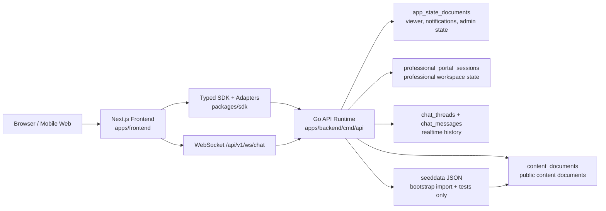

### Ownership summary

- Frontend owns route rendering, interaction state, and UX composition.
- SDK owns typed transport boundaries between frontend and backend.
- Backend owns API contract, auth, persistence, and error semantics.
- PostgreSQL owns mutable runtime state and public content documents.
- Seed data is no longer the live request-time source of truth; it is import material and QA/test fixture input.

## 2. Monorepo Control Plane

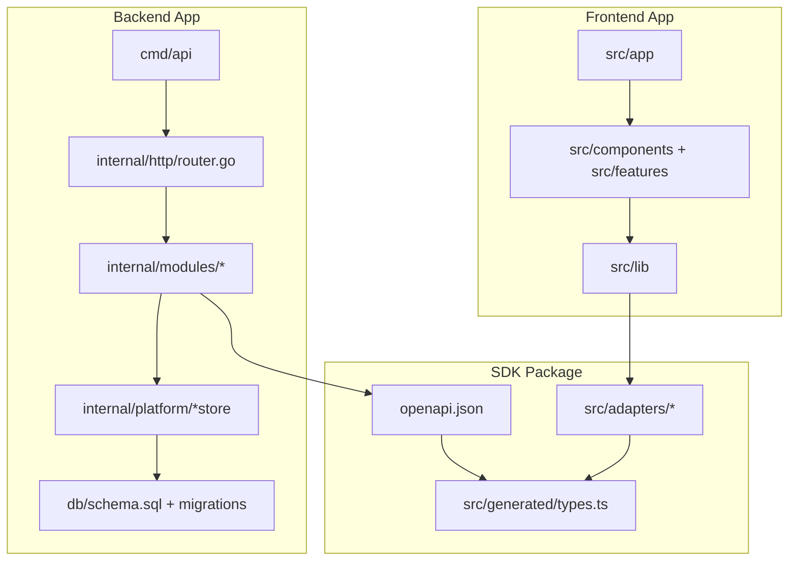

### Maintenance note

- If a user-facing bug shows wrong data shape, check `packages/sdk` and backend route contracts first.
- If a page renders the right shape but wrong behavior, check frontend adapters and page-level hooks.
- If persistence is wrong, check the backend module service and its `internal/platform/*store` implementation.

## 3. Backend Runtime Boot Flow

Primary file: `apps/backend/cmd/api/main.go`

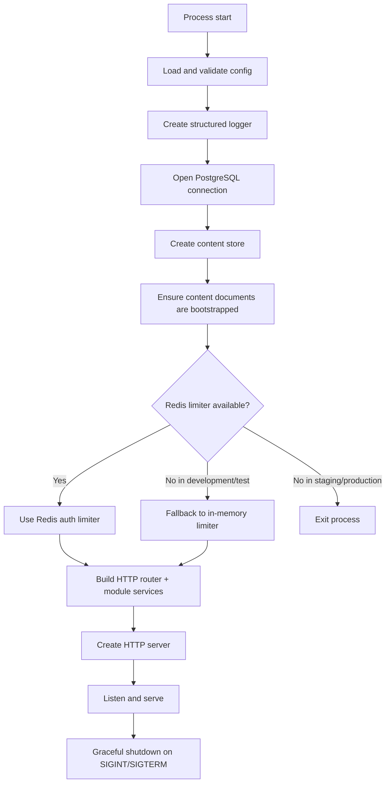

### Boot responsibilities

- `config.Load()` is fail-fast and should reject bad production config before runtime starts.
- `readmodel.NewRepository(...).EnsureBootstrapped(...)` guarantees the public content layer exists before serving traffic.
- The auth rate limiter is intentionally strict in staging and production, but developer-friendly in development and test.

## 4. HTTP Request Pipeline

Primary file: `apps/backend/internal/http/router.go`

```mermaid
flowchart LR
  request["Incoming HTTP request"] --> headers["SecurityHeaders"]
  headers --> cors["CORS"]
  cors --> reqid["RequestID"]
  reqid --> recover["Recover"]
  recover --> log["LogRequest"]
  log --> rate["AuthRateLimit"]
  rate --> origin["CookieOriginGuard"]
  origin --> admin["AdminAuth middleware"]
  admin --> customer["CustomerAuth middleware"]
  customer --> professional["ProfessionalAuth middleware"]
  professional --> mux["ServeMux + Huma routes"]
```

### Why this order matters

- Security headers and CORS run before business logic.
- Auth rate limiting happens before login endpoints hit the auth services.
- Cookie origin guard protects unsafe cookie-authenticated requests from cross-site misuse.
- Role middleware enriches request context only when the path belongs to that role domain.

## 5. REST Domain Map

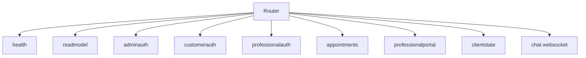

### Route ownership

| Domain | Main purpose | Key endpoints |
| --- | --- | --- |
| `health` | service liveness and metadata | `GET /api/v1/health` |
| `readmodel` | public catalog, professionals, bootstrap, appointments, chat snapshots | `GET /catalog`, `GET /professionals`, `GET /bootstrap`, `GET /appointments`, `GET /chat` |
| `adminauth` | admin login/session lifecycle | `POST/GET/PUT/DELETE /admin/auth/session` |
| `customerauth` | customer account + session lifecycle | `POST /customers/auth/register`, `POST/GET/DELETE /customers/auth/session`, `PUT /customers/auth/account`, `PUT /customers/auth/password` |
| `professionalauth` | professional account + session lifecycle | `POST /professionals/auth/register`, `POST/GET/DELETE /professionals/auth/session`, `PUT /professionals/auth/account`, `PUT /professionals/auth/password` |
| `professionalportal` | professional dashboard and workspace persistence | `GET/PUT /professionals/portal/session`, `GET/PUT /professionals/me/*` |
| `appointments` | appointment mutations backed by portal state | appointment write services exposed through Huma runtime |
| `clientstate` | viewer session, notifications, preferences, admin support and console | `/viewer/session`, `/notifications/*`, `/consumers/preferences`, `/admin/support-desk`, `/admin/console`, `/admin/console/tables/{table_name}` |
| `chat` | realtime thread transport | `GET /api/v1/ws/chat` |

## 6. Public Read Flow

Primary backend files:

- `apps/backend/internal/modules/readmodel/service.go`
- `apps/backend/internal/modules/readmodel/repository.go`
- `apps/backend/internal/platform/contentstore/postgres.go`

Primary frontend files:

- `apps/frontend/src/lib/public-bootstrap.ts`
- `apps/frontend/src/lib/use-catalog-read-model.ts`
- `apps/frontend/src/app/[locale]/home/page.tsx`
- `apps/frontend/src/app/[locale]/explore/page.tsx`
- `apps/frontend/src/app/[locale]/services/page.tsx`

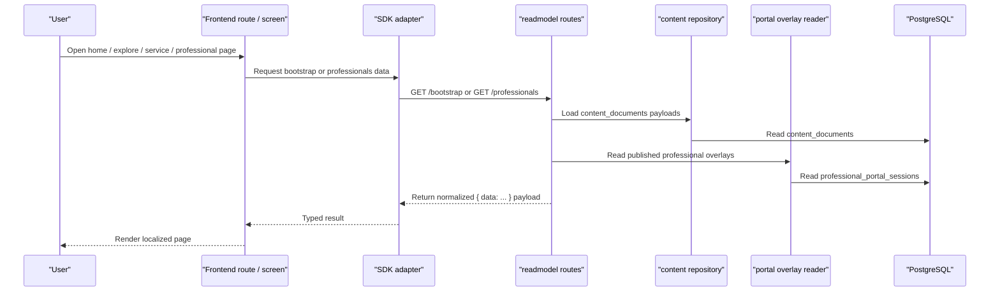

### What changes the public pages

- Seed content affects bootstrap import only, not steady-state requests.
- Published professional portal changes can overlay the stored public content snapshot.
- Frontend public pages should prefer backend bootstrap and read-model helpers, with fallback only as controlled resilience behavior.

## 7. Authentication Flow

All three auth domains follow the same high-level shape with different identity records and scope rules.

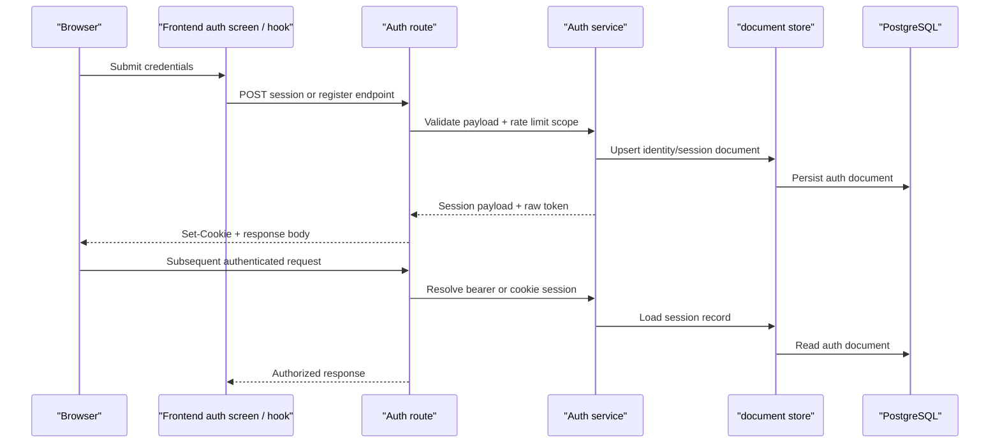

### Role-specific sources

- Admin auth uses configured admin credentials plus session records in `app_state_documents`.
- Customer auth persists customer account and session data in document state.
- Professional auth persists professional account and session data and can validate against professional catalog identity.

### Maintenance checkpoints

- If login is failing for all roles, inspect middleware, cookie config, and rate limiter first.
- If only one role breaks, inspect that role's service and route contract.
- If bearer works but cookie does not, inspect cookie config, CORS origins, and cookie origin guard behavior.

## 8. Professional Portal Mutation Flow

Primary files:

- `apps/backend/internal/modules/professionalportal/service.go`
- `apps/backend/internal/platform/portalstore/postgres.go`
- `apps/frontend/src/lib/use-professional-portal.ts`
- `apps/frontend/src/lib/professional-portal-api.ts`
- `apps/frontend/src/features/professional-portal/lib/repository.ts`

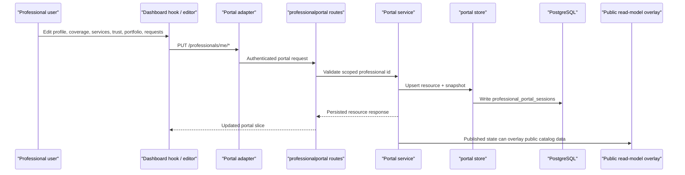

### Why this matters for maintenance

- Portal writes are not isolated drafts anymore; they can influence public read results when state is published.
- Bugs on public professional detail pages can originate in portal persistence, not only in read-model seed content.

## 9. Client State Flow

Primary files:

- `apps/backend/internal/modules/clientstate/service.go`
- `apps/backend/internal/platform/documentstore/postgres.go`
- `apps/frontend/src/lib/app-state-api.ts`
- `apps/frontend/src/lib/use-viewer-session.ts`
- `apps/frontend/src/lib/use-customer-notifications.ts`
- `apps/frontend/src/lib/use-professional-notifications.ts`
- `apps/frontend/src/features/admin/hooks/useAdminConsoleData.ts`

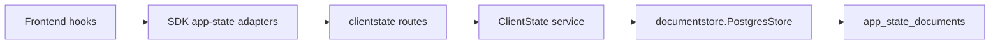

### Main state families

- viewer shell state
- customer notification read state
- professional notification read state
- consumer preferences
- admin session
- support desk snapshot
- admin console aggregate snapshot
- admin console table-level resources

### Maintenance rule

- If the problem is per-user persisted shell state, inspect `clientstate`.
- If the problem is public content or directory data, inspect `readmodel`.
- If the problem is professional dashboard workspace state, inspect `professionalportal`.

## 10. Realtime Chat Flow

Primary files:

- `apps/backend/internal/modules/chat/handler.go`
- `apps/backend/internal/modules/chat/hub.go`
- `apps/backend/internal/modules/chat/store_postgres.go`
- `apps/frontend/src/lib/use-realtime-chat-thread.ts`
- `apps/frontend/src/components/screens/ChatScreen.tsx`

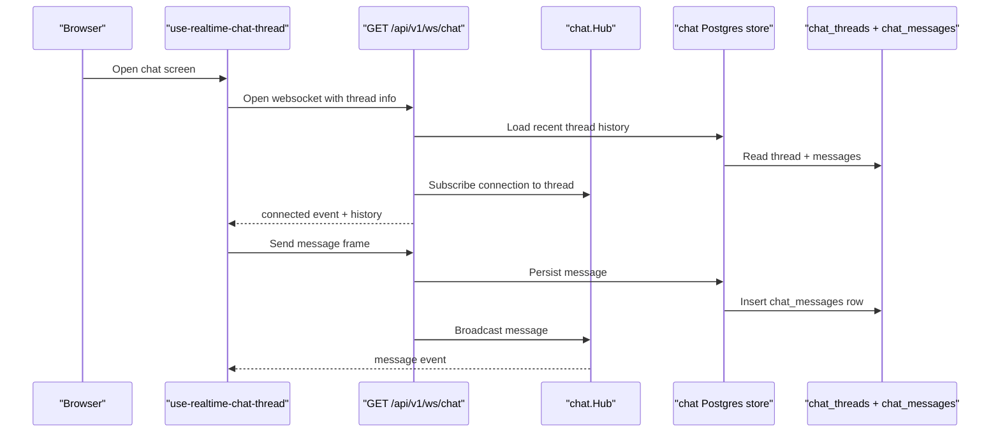

### Maintenance note

- If messages are missing after refresh, inspect store persistence.
- If live updates fail but history loads, inspect hub subscription or websocket origin handling.
- If read-model chat list is wrong but live thread works, inspect `readmodel.Chat`, not the websocket handler first.

## 11. Seeder And QA Flow

Primary files:

- `apps/backend/cmd/seed/main.go`
- `apps/backend/internal/seeding/seeder.go`
- `apps/backend/internal/seeding/summary.go`
- `scripts/qa/run-seeded-smoke.mjs`

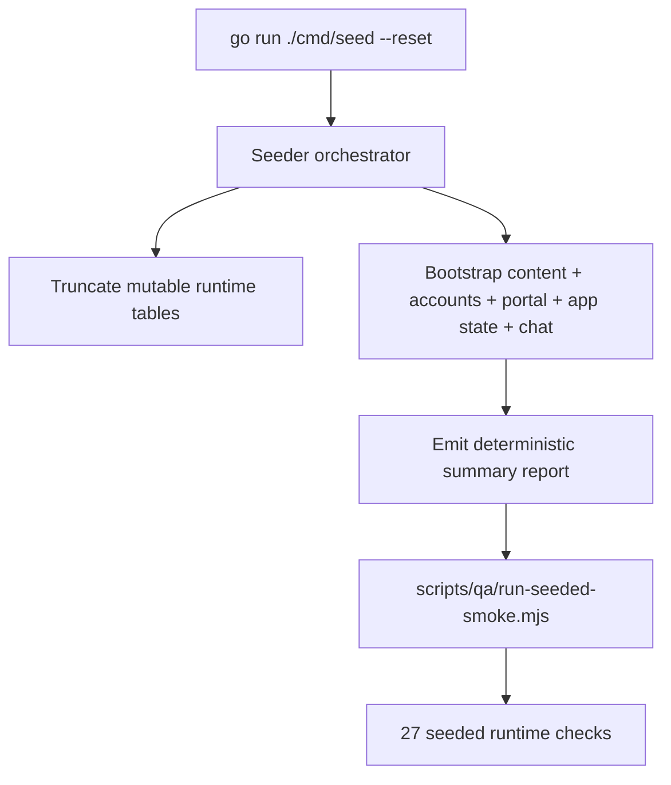

### Why maintainers should care

- The seed report is now a truth source for smoke scenarios.
- If a feature looks broken only in QA smoke, compare the seeded scenario assumptions before changing runtime code.

## 12. Deploy And Release Flow

Primary files:

- `scripts/deploy/check-env.mjs`
- `scripts/deploy/build-images.sh`
- `scripts/deploy/apply-migrations.mjs`
- `scripts/deploy/deploy.sh`
- `scripts/deploy/post-deploy-smoke.mjs`
- `ops/deploy/docker-compose.yml`

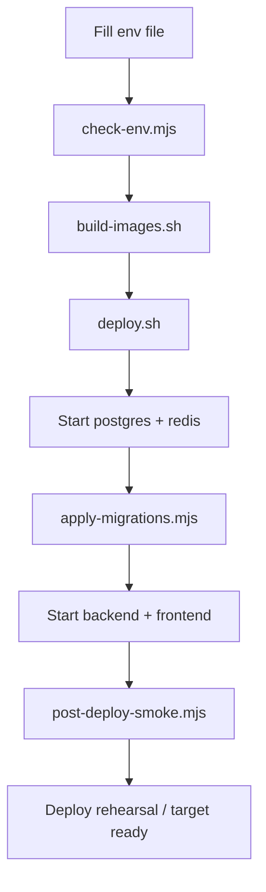

### Important rollout semantics

- `local-smoke` is a real deployment rehearsal path, not a fake shortcut.
- `deploy.sh` now validates env, brings up database infrastructure first, applies Atlas migrations, then starts app containers.
- `POSTGRES_PORT` is loopback-only and exists to let Atlas reach the deployment database safely from the host.

## 13. Maintenance Entry Points

When a problem appears, start here:

| Symptom | First files to inspect | Likely layer |
| --- | --- | --- |
| Public home/explore/service detail is wrong | `apps/frontend/src/lib/public-bootstrap.ts`, `apps/backend/internal/modules/readmodel/service.go`, `apps/backend/internal/platform/contentstore/postgres.go` | read-model |
| Professional dashboard data disappears after refresh | `apps/frontend/src/lib/use-professional-portal.ts`, `apps/backend/internal/modules/professionalportal/service.go`, `apps/backend/internal/platform/portalstore/postgres.go` | portal persistence |
| Admin login or support desk fails | `apps/frontend/src/features/admin/hooks/useAdminSession.ts`, `apps/backend/internal/modules/adminauth/service.go`, `apps/backend/internal/modules/clientstate/service.go` | admin auth/state |
| Customer profile or preferences fail to persist | `apps/frontend/src/features/profile/hooks/useProfileSettings.ts`, `apps/backend/internal/modules/customerauth/service.go`, `apps/backend/internal/modules/clientstate/service.go` | customer auth/state |
| Realtime chat fails | `apps/frontend/src/lib/use-realtime-chat-thread.ts`, `apps/backend/internal/modules/chat/handler.go`, `apps/backend/internal/modules/chat/hub.go`, `apps/backend/internal/modules/chat/store_postgres.go` | websocket/chat |
| Deploy stack boots but app is unhealthy | `scripts/deploy/deploy.sh`, `scripts/deploy/apply-migrations.mjs`, `ops/deploy/docker-compose.yml`, `apps/backend/cmd/api/main.go` | deploy/runtime bootstrap |

## 14. Recommended Maintenance Loop

1. Identify whether the problem is public read, role auth, role workspace, client state, realtime, or deploy.
2. Find the owning backend module first.
3. Confirm the SDK adapter that frontend uses for that module.
4. Check the persistent store implementation backing that module.
5. Reproduce with either seeded smoke or local deploy smoke before changing code.
6. Update this diagram document when ownership or flow boundaries change.
