# User-Facing Flow Diagrams

This document explains the product from the outside in.

Use it when you need to:

- understand what each user role can see and do
- trace a user action to the frontend hook, backend domain, and persisted state it touches
- onboard product, QA, design, support, or a new engineer without starting from backend internals
- review whether a proposed UI change matches the real runtime behavior
- debug a report that starts with "the user clicked X and then Y happened"

Read this together with:

- [System Flow Diagrams](./system-flow-diagrams.md)
- [Architecture](./architecture.md)
- [Frontend Guide](./frontend.md)
- [Backend Guide](./backend.md)
- [User Flow Pack](./user-flows/README.md)
- [Professional Onboarding Flow](./professional-onboarding-flow.md)
- [Service To Appointment Flow](./service-to-appointment-flow.md)

## 1. Persona Overview

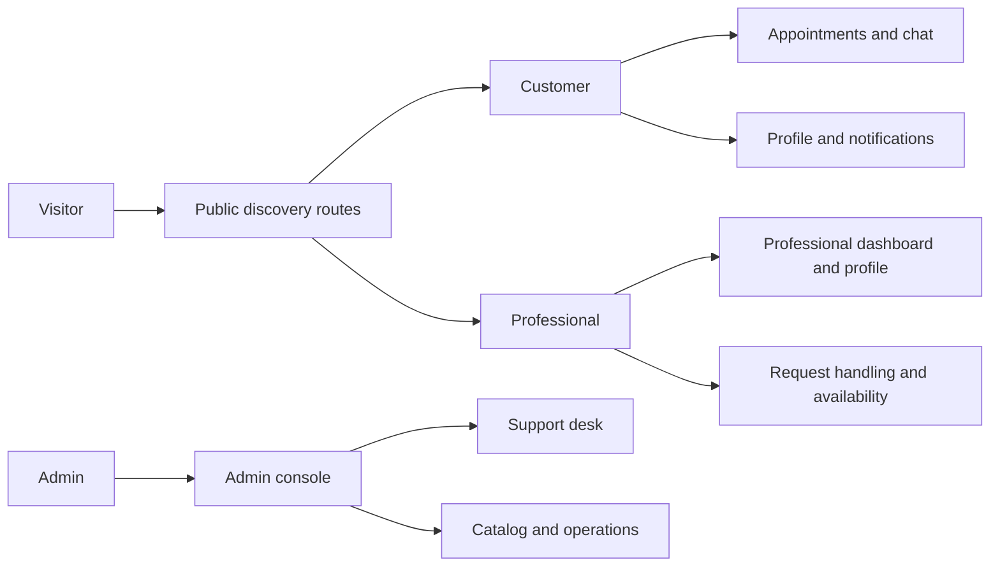

### Main user-facing surfaces

| Persona | Main routes | Main goal |
| --- | --- | --- |
| Visitor | `/home`, `/explore`, `/services`, `/p/[slug]`, `/s/[slug]` | discover services and professionals |
| Customer | `/auth/customer`, `/appointments`, `/appointments/[id]`, `/activity/[id]`, `/notifications`, `/profile` | sign in, book, track, chat, manage account |
| Professional | `/for-professionals`, `/for-professionals/dashboard/*`, `/for-professionals/profile` | sign in, complete onboarding, manage services, handle requests |
| Admin | `/admin/login`, `/admin/overview`, `/admin/customers`, `/admin/professionals`, `/admin/services`, `/admin/appointments`, `/admin/support`, `/admin/studio` | operate the system, review records, handle support, inspect runtime data |

## 2. Route Inventory By Persona

### Detailed persona packs

If you want the deeper per-role breakdown, continue with:

- [Customer Journeys](./user-flows/customer.md)
- [Professional Journeys](./user-flows/professional.md)
- [Admin Journeys](./user-flows/admin.md)

### Visitor and public discovery

| Route | Main screen behavior | Main state owner |
| --- | --- | --- |
| `/home` | shows personalized home feed, nearby professionals, and featured appointment if any | `readmodel` + app shell bootstrap |
| `/explore` | shows searchable professionals and service categories | `readmodel` bootstrap and catalog helpers |
| `/services` | shows service catalog and entry points into professional detail | `readmodel` bootstrap |
| `/s/[slug]` | service detail with CTA into professional booking | `readmodel` bootstrap |
| `/p/[slug]` | professional detail with service selection, availability, trust, and booking composer | `readmodel` + professional portal overlay |

### Customer routes

| Route | Entry guard | Main behavior | Main backend domains |
| --- | --- | --- | --- |
| `/auth/customer` | none | login, register, continue as visitor | `customerauth`, `clientstate.viewer` |
| `/appointments` | customer auth required for full experience | list active and history appointments, open detail, chat, cancel, pay, review | `professionalportal`, `appointments`, `chat` |
| `/appointments/[id]` | customer auth expected | detail-first appointment view | `professionalportal`, `appointments` |
| `/activity/[id]` | customer auth expected | timeline-style activity feed for a single appointment | `professionalportal`, `appointments`, `chat` |
| `/notifications` | customer auth recommended | appointment-derived notifications and reminders | `clientstate.notifications.customer`, `professionalportal` |
| `/profile` | customer auth required | account settings, password update, support, logout | `customerauth`, `clientstate.viewer` |

### Professional routes

| Route | Entry guard | Main behavior | Main backend domains |
| --- | --- | --- | --- |
| `/for-professionals` | none | login, register, account switch, password recovery | `professionalauth`, `professionalportal`, `clientstate.viewer` |
| `/for-professionals/dashboard/requests` | professional auth required | handle booking/request queue and status transitions | `professionalportal`, `appointments`, `clientstate.notifications.professional` |
| `/for-professionals/dashboard/services` | professional auth required | activate, edit, and publish service offerings | `professionalportal` |
| `/for-professionals/dashboard/availability` | professional auth required | configure weekly hours and booking policies | `professionalportal` |
| `/for-professionals/dashboard/coverage` | professional auth required | manage coverage areas, address, home-visit radius | `professionalportal` |
| `/for-professionals/dashboard/portfolio` | professional auth required | manage public portfolio and gallery | `professionalportal` |
| `/for-professionals/dashboard/trust` | professional auth required | manage credentials and activity stories | `professionalportal` |
| `/for-professionals/profile` | professional auth required | manage account profile and password | `professionalauth`, `professionalportal` |

### Admin routes

| Route | Entry guard | Main behavior | Main backend domains |
| --- | --- | --- | --- |
| `/admin/login` | none | admin session login and session resume | `adminauth` |
| `/admin/overview` | admin auth required | top-level ops summary and entrypoint | `clientstate.admin.console`, `readmodel` |
| `/admin/customers` | admin auth required | inspect customers and linked context | `clientstate.admin.console` |
| `/admin/professionals` | admin auth required | inspect professionals and operational data | `clientstate.admin.console`, `professionalportal` |
| `/admin/services` | admin auth required | inspect services, categories, offerings | `clientstate.admin.console`, `readmodel` |
| `/admin/appointments` | admin auth required | inspect appointment rows and statuses | `clientstate.admin.console`, `readmodel`, `appointments` |
| `/admin/support` | admin auth required | triage support desk workload | `clientstate.admin.support-desk` |
| `/admin/studio` | admin auth required | snapshot-style admin data editing and import/export | `clientstate.admin.console` |

## 3. Visitor Discovery Journey

This is the default user-facing funnel before authentication.

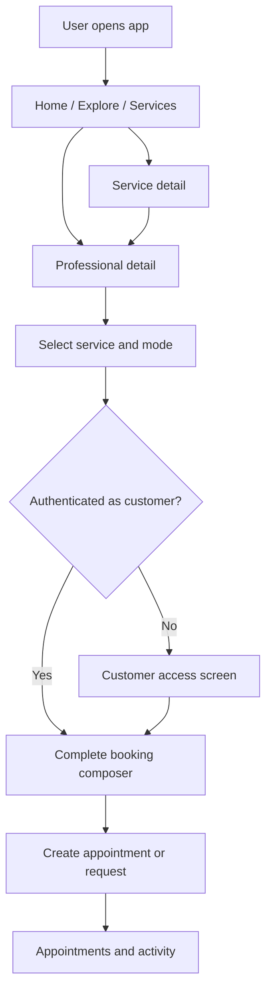

### Behavior notes

- Public discovery is always backed by the backend read-model, not browser-owned mock data.
- Service detail does not create a transaction by itself.
- The real transaction entry point is the professional detail composer because that is where coverage, mode, availability, and service offering validity are checked together.
- Only `published` professionals appear as normal public catalog entries.

### Relevant implementation points

- Route helpers: `apps/frontend/src/lib/routes.ts`
- Public bootstrap: `apps/frontend/src/lib/public-bootstrap.ts`
- Public read source: `apps/frontend/src/lib/public-bootstrap-source.ts`
- Catalog hydration: `apps/frontend/src/lib/use-catalog-read-model.ts`
- Backend read-model: `apps/backend/internal/modules/readmodel/service.go`

## 4. Customer Access And Identity Behavior

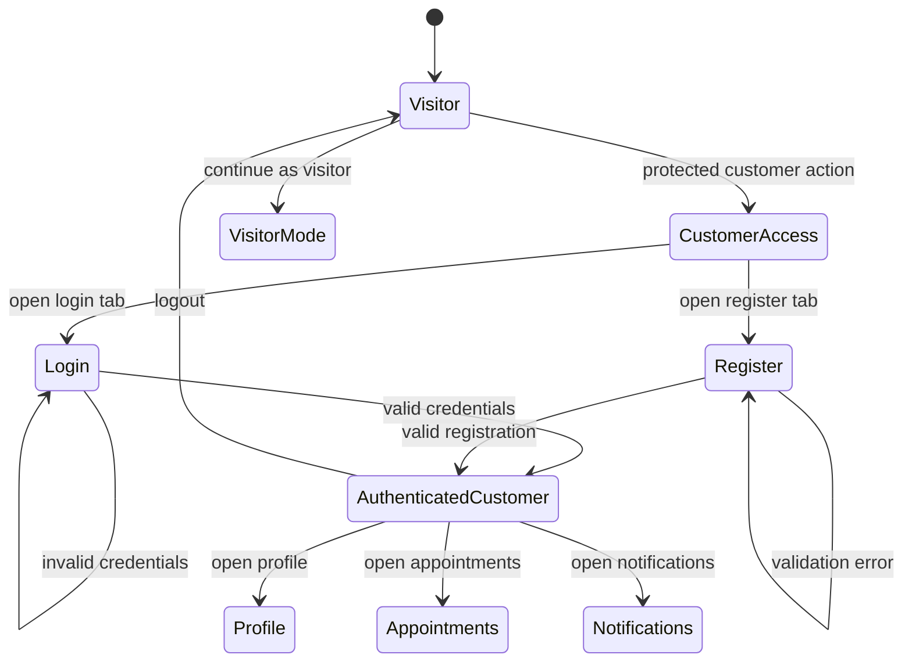

### What the customer access screen really does

| User action | Frontend result | Backend result |
| --- | --- | --- |
| login | `useCustomerAuthSession().login(...)` | `POST /customers/auth/session` creates or refreshes customer session |
| register | `useCustomerAuthSession().register(...)` | `POST /customers/auth/register` creates account and session |
| continue as visitor | viewer mode changes without account ownership | viewer state remains lightweight and non-authoritative |
| revisit protected route with active session | screen reuses hydrated session and redirects | `GET /customers/auth/session` validates the stored session |

### Main files

- `apps/frontend/src/components/screens/CustomerAccessScreen.tsx`
- `apps/frontend/src/lib/use-customer-auth-session.ts`
- `apps/frontend/src/lib/use-viewer-session.ts`
- `apps/backend/internal/modules/customerauth/routes.go`
- `apps/backend/internal/modules/customerauth/service.go`

## 5. Customer Booking And Appointment Lifecycle

This is the most important user-facing business journey in the product.

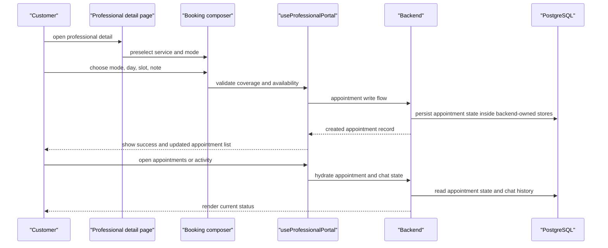

### Booking state machine

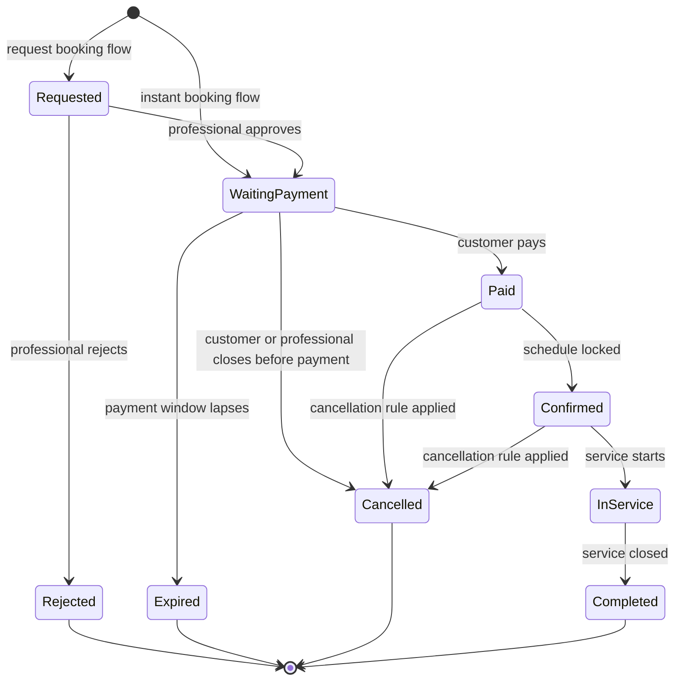

### Customer-facing behavior by screen

| Screen | What the user can do | State transition |
| --- | --- | --- |
| professional detail | choose service, mode, schedule, and note | creates appointment or request |
| appointments list | filter active/history, open detail, open chat, pay, cancel, review | reads and mutates appointment state |
| appointment detail | inspect immutable snapshots and timeline | read-only except actions exposed by current status |
| activity page | view status history and related actions | mirrors appointment lifecycle |
| chat | message the professional in allowed statuses | appends realtime chat messages |
| notifications | open reminders and appointment updates | marks notification state read/unread in backend |

### Main business rules that shape the UI

- `request` booking flow enters `requested`.
- `instant` booking flow enters `approved_waiting_payment`.
- Chat is only available for statuses allowed by `isAppointmentChatAvailable(...)`.
- Formal reschedule is not a first-class transaction; operationally the flow is cancel and create a new booking.
- Old appointments keep immutable service, schedule, and cancellation snapshots even if the professional edits the offering later.

### Main files

- `apps/frontend/src/features/appointments/hooks/useAppointmentFlow.ts`
- `apps/frontend/src/features/appointments/components/AppointmentDetailSheet.tsx`
- `apps/frontend/src/components/screens/ChatScreen.tsx`
- `apps/frontend/src/lib/use-realtime-chat-thread.ts`
- `apps/frontend/src/lib/use-professional-portal.ts`
- `apps/backend/internal/modules/appointments`
- `apps/backend/internal/modules/chat`

## 6. Customer Support, Notifications, And Profile Behavior

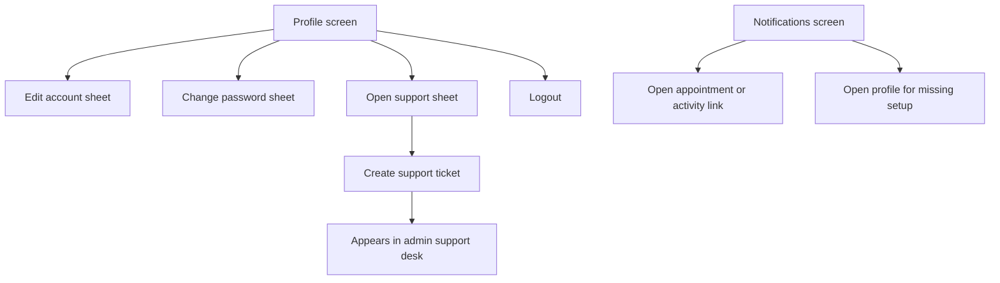

### Behavior details

- Profile is customer-authenticated. If the viewer is not a customer, the app shows the customer access screen first.
- The profile screen can route a professional user away to the professional profile surface to avoid cross-role confusion.
- Support submission from customer profile is a user-facing funnel into admin operations.
- Customer notifications are derived from appointment state plus profile/setup reminders, then persisted as read state in backend-owned client state.

### Main files

- `apps/frontend/src/components/screens/ProfileScreen.tsx`
- `apps/frontend/src/features/profile/hooks/useProfileSettings.ts`
- `apps/frontend/src/lib/use-customer-notifications.ts`
- `apps/frontend/src/features/profile/components/ProfileSupportCenter.tsx`
- `apps/backend/internal/modules/clientstate/routes.go`

## 7. Professional Access Behavior

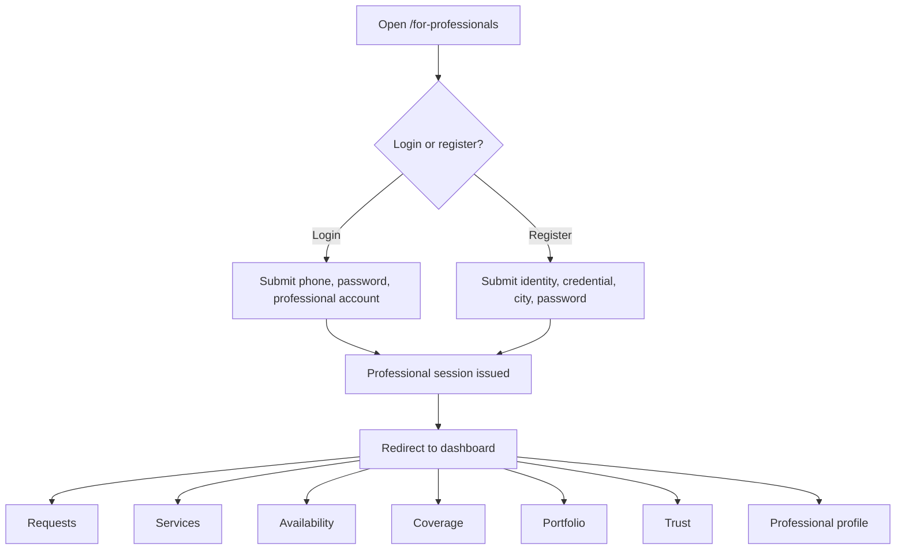

### What is special about professional access

- The professional can select which professional identity they are logging into.
- Registration stores both account-level data and portal-level bootstrap data.
- Password recovery is part of the same user-facing surface.
- After login or register, the app immediately transitions into professional operational state instead of a separate waiting room.

### Main files

- `apps/frontend/src/components/screens/ProfessionalAccessScreen.tsx`
- `apps/frontend/src/lib/use-professional-auth-session.ts`
- `apps/frontend/src/lib/use-professional-portal.ts`
- `apps/backend/internal/modules/professionalauth/routes.go`
- `apps/backend/internal/modules/professionalportal/routes.go`

## 8. Professional Onboarding And Publishing Lifecycle

This is the professional user-facing lifecycle before the professional is truly live in the public catalog.

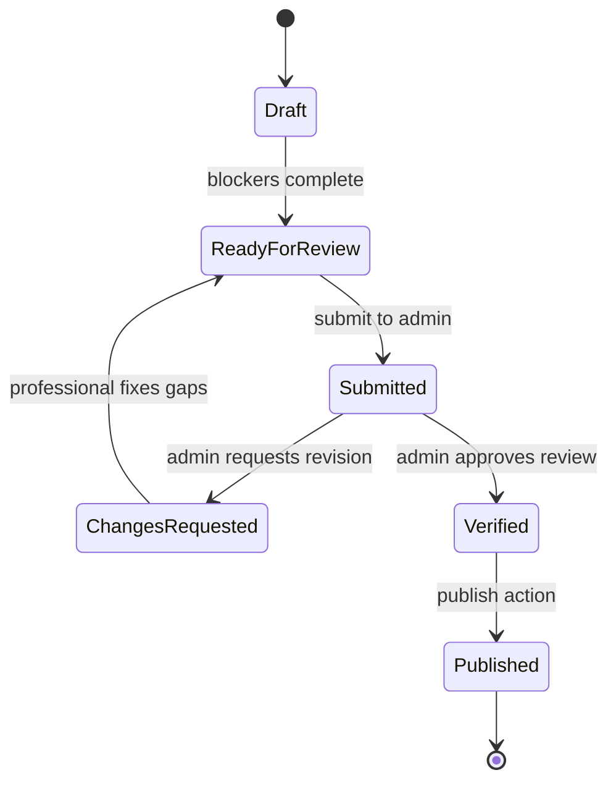

### Dashboard meaning by lifecycle status

| Lifecycle status | What the professional sees | What the public sees |
| --- | --- | --- |
| `draft` | onboarding prompts, incomplete sections, no live operations | not visible in public catalog |
| `ready_for_review` | ready-to-submit state and review CTA | not visible |
| `submitted` | waiting-for-admin state, mostly read-only emphasis | not visible |
| `changes_requested` | highlighted gaps and resubmit prompts | not visible |
| `verified` | approved but pending publish | not visible |
| `published` | full operational dashboard | visible in public catalog and detail routes |

### Section ownership inside the dashboard

| Section | User-facing purpose | Backend resource |
| --- | --- | --- |
| requests | handle incoming booking demand | portal request and appointment resources |
| services | activate and configure offerings | professional portal services resource |
| availability | define weekly and per-mode time rules | professional portal availability resource |
| coverage | define where home visit and practice reach are valid | professional portal coverage resource |
| portfolio | make public proof of work visible | professional portal portfolio and gallery resources |
| trust | show credentials and activity stories | professional portal trust resource |

### Main files

- `apps/frontend/src/components/screens/professional-dashboard/useProfessionalDashboardPageData.ts`
- `apps/frontend/src/lib/use-professional-portal.ts`
- `apps/backend/internal/modules/professionalportal/service.go`
- `apps/backend/internal/modules/readmodel/portal_overlay.go`

## 9. Professional Request Handling Behavior

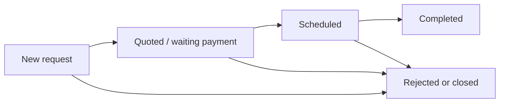

### User-facing interpretation

| Request board bucket | Underlying appointment states |
| --- | --- |
| `new` | `requested` |
| `quoted` | `approved_waiting_payment`, `paid` |
| `scheduled` | `confirmed`, `in_service` |
| `completed` | `completed`, `cancelled`, `rejected`, `expired` |

### Professional actions that matter

- approve a request
- close or reject a request
- confirm a schedule
- mark service in progress or completed
- see the current customer-facing summary of each status change
- receive notifications that deep-link into the request board

### Cross-role impact

- Each professional status change affects what the customer sees in appointments, activity, chat context, and notifications.
- Published portal state also affects public professional detail content when the data is public-facing.

## 10. Admin User-Facing Console

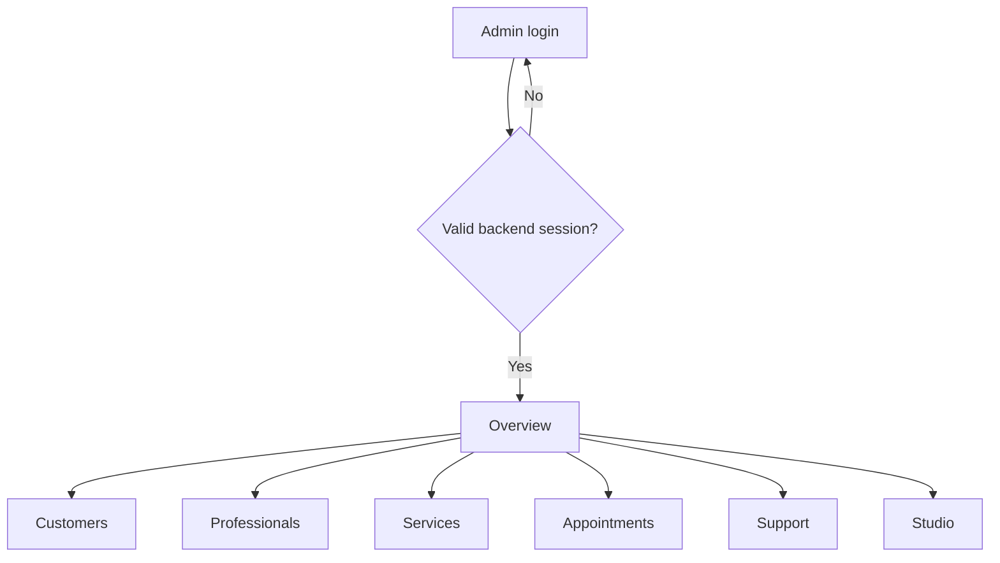

### Admin screen behavior

| Screen | User-facing purpose | Behavior detail |
| --- | --- | --- |
| login | enter admin console | restores last route if session is still valid |
| overview | quick ops entrypoint | summarizes the most important datasets and shortcuts |
| customers | inspect customer identities and context | reads console snapshot tables |
| professionals | inspect professional records | cross-checks operational and catalog-facing state |
| services | inspect services and categories | edits console-backed tables |
| appointments | inspect appointment rows | tracks lifecycle and operational issues |
| support | triage support tickets | assignment, status, and escalation live here |
| studio | data operations surface | import, export, reset, and snapshot-level maintenance |

### Admin hydration model

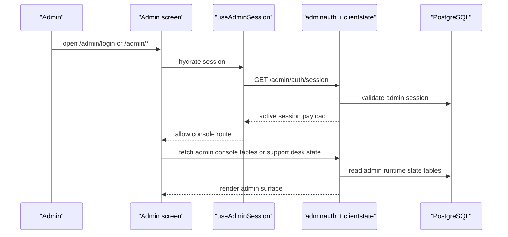

### Main files

- `apps/frontend/src/components/screens/admin/AdminLoginScreen.tsx`
- `apps/frontend/src/features/admin/hooks/useAdminSession.ts`
- `apps/frontend/src/features/admin/hooks/useAdminConsoleData.ts`
- `apps/frontend/src/features/admin/hooks/useSupportDesk.ts`
- `apps/backend/internal/modules/adminauth/routes.go`
- `apps/backend/internal/modules/clientstate/routes.go`

## 11. Cross-Persona Behavior Map

This table is useful when someone reports a behavior change and you want to understand who else is affected.

| User action | Directly affected persona | Secondary affected persona | Why |
| --- | --- | --- | --- |
| customer creates booking | customer | professional, admin | request board, notifications, and admin appointment views all change |
| professional publishes profile | professional | visitor, customer, admin | public catalog and professional detail change |
| professional edits coverage | professional | customer | home-visit eligibility and booking composer options change |
| customer opens support ticket | customer | admin | support desk workload changes |
| admin edits catalog table | admin | visitor, customer, professional | public discovery and operational lookup screens may change |
| admin changes appointment row | admin | customer, professional | lifecycle, notifications, and support context may change |

## 12. Maintenance Guide By User Report

| If the report starts like this | Check these frontend files first | Check these backend files next |
| --- | --- | --- |
| "Home or explore shows the wrong professional" | `apps/frontend/src/lib/public-bootstrap.ts`, `apps/frontend/src/lib/use-catalog-read-model.ts` | `apps/backend/internal/modules/readmodel/service.go`, `apps/backend/internal/modules/readmodel/portal_overlay.go` |
| "I cannot sign in as customer" | `apps/frontend/src/components/screens/CustomerAccessScreen.tsx`, `apps/frontend/src/lib/use-customer-auth-session.ts` | `apps/backend/internal/modules/customerauth/service.go` |
| "Booking button is there but schedule is wrong" | `apps/frontend/src/features/appointments/hooks/useAppointmentFlow.ts`, `apps/frontend/src/lib/use-professional-portal.ts` | `apps/backend/internal/modules/professionalportal`, `apps/backend/internal/modules/appointments` |
| "Chat is open but messages do not move" | `apps/frontend/src/components/screens/ChatScreen.tsx`, `apps/frontend/src/lib/use-realtime-chat-thread.ts` | `apps/backend/internal/modules/chat` |
| "Professional dashboard says published but public page does not update" | `apps/frontend/src/lib/use-professional-portal.ts` | `apps/backend/internal/modules/professionalportal/service.go`, `apps/backend/internal/modules/readmodel/portal_overlay.go` |
| "Admin login loops or loses session" | `apps/frontend/src/components/screens/admin/AdminLoginScreen.tsx`, `apps/frontend/src/features/admin/hooks/useAdminSession.ts` | `apps/backend/internal/modules/adminauth/service.go`, `apps/backend/internal/http/middleware` |
| "Support ticket submitted but admin cannot see it" | `apps/frontend/src/features/profile/components/ProfileSupportCenter.tsx`, `apps/frontend/src/features/admin/hooks/useSupportDesk.ts` | `apps/backend/internal/modules/clientstate/service.go` |

## 13. Recommended Reading Path

If you are debugging by persona, this order is the fastest:

1. read this document for user-facing context
2. open [System Flow Diagrams](./system-flow-diagrams.md) for ownership and request paths
3. open the relevant feature guide or specialized flow doc
4. inspect the listed frontend hook or screen
5. inspect the backend domain named in the same section

This split keeps maintenance practical:

- this document answers "what does the user experience?"
- [System Flow Diagrams](./system-flow-diagrams.md) answers "which subsystem owns it?"
- the feature docs answer "what are the detailed domain rules?"
