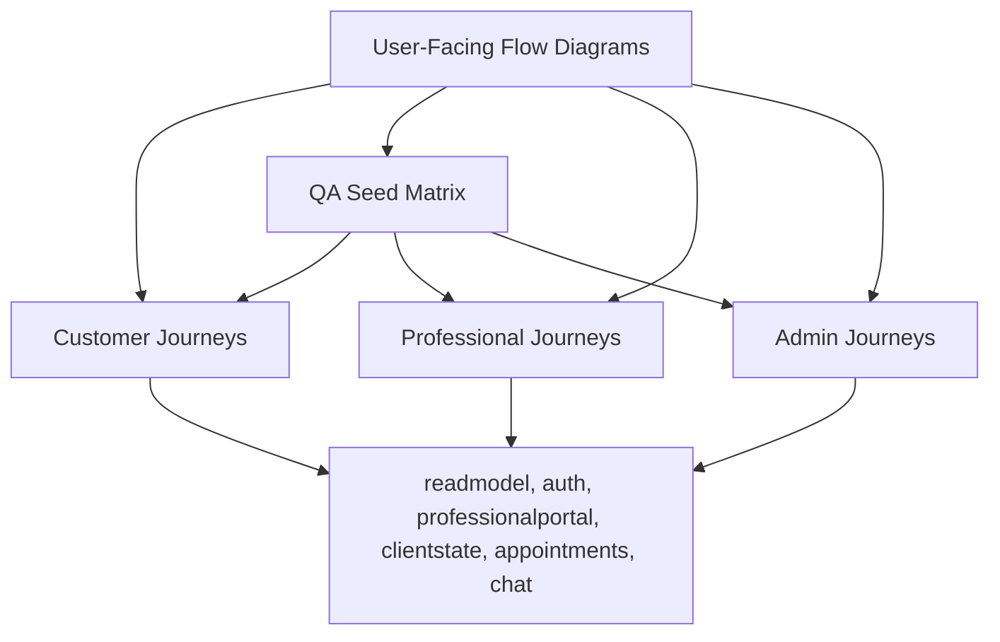

# User Flow Pack

This folder is the persona-centric handbook for BidanApp.

Use it when you want to understand the application the same way a real operator, user, or QA person experiences it.

## Reading Order

1. [User-Facing Flow Diagrams](../user-facing-flow-diagrams.md)
2. [QA Seed Matrix](../qa-seed-matrix.md)
3. [Customer Journeys](./customer.md)
4. [Professional Journeys](./professional.md)
5. [Admin Journeys](./admin.md)

## Pack Structure

## When To Use Which File

| File | Best for |
| --- | --- |
| [User-Facing Flow Diagrams](../user-facing-flow-diagrams.md) | quick orientation across all personas |
| [QA Seed Matrix](../qa-seed-matrix.md) | seeded accounts, manual QA checklist, and automated verification commands |
| [Customer Journeys](./customer.md) | discovery, booking, appointments, notifications, profile, support |
| [Professional Journeys](./professional.md) | access, onboarding, dashboard operations, publication behavior |
| [Admin Journeys](./admin.md) | admin login, console modules, support desk, studio, ops impact |

## Maintenance Rule

- Update the persona file when screen behavior changes.
- Update the system-level diagrams when ownership or runtime architecture changes.
- Update both when a change alters both the user experience and the subsystem boundary.
