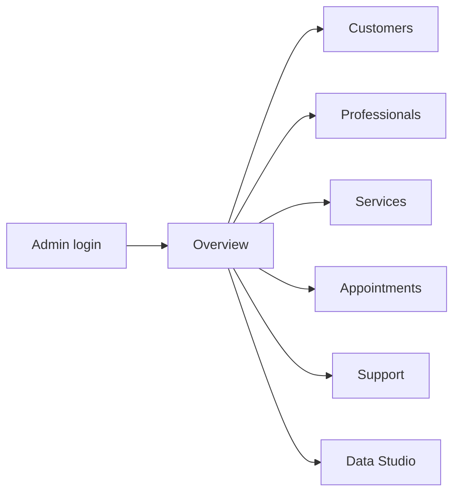
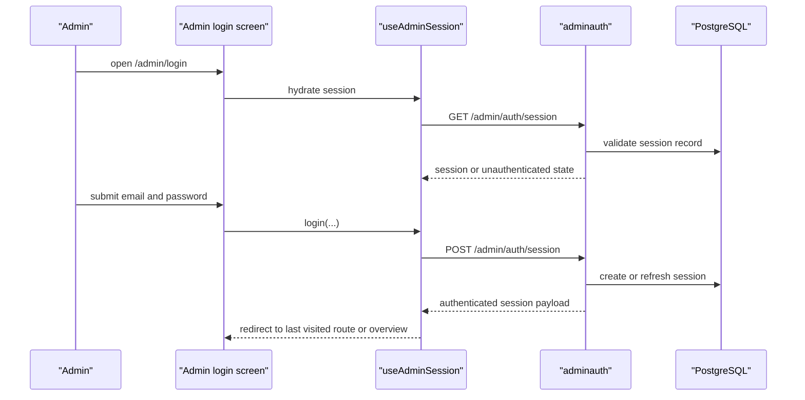
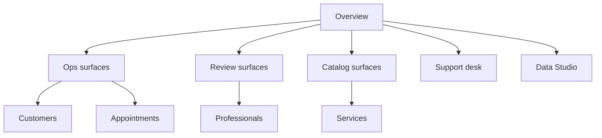
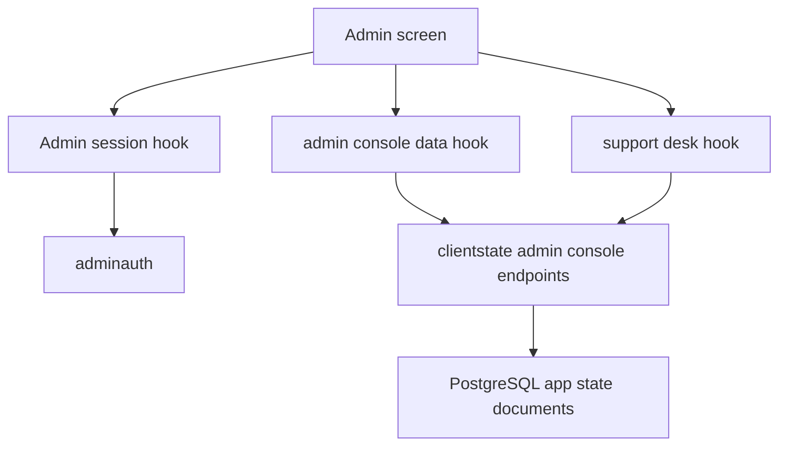
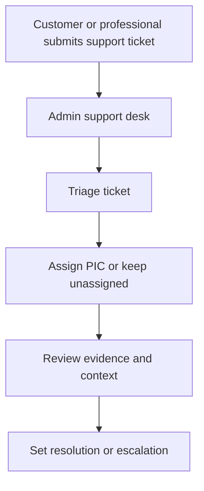
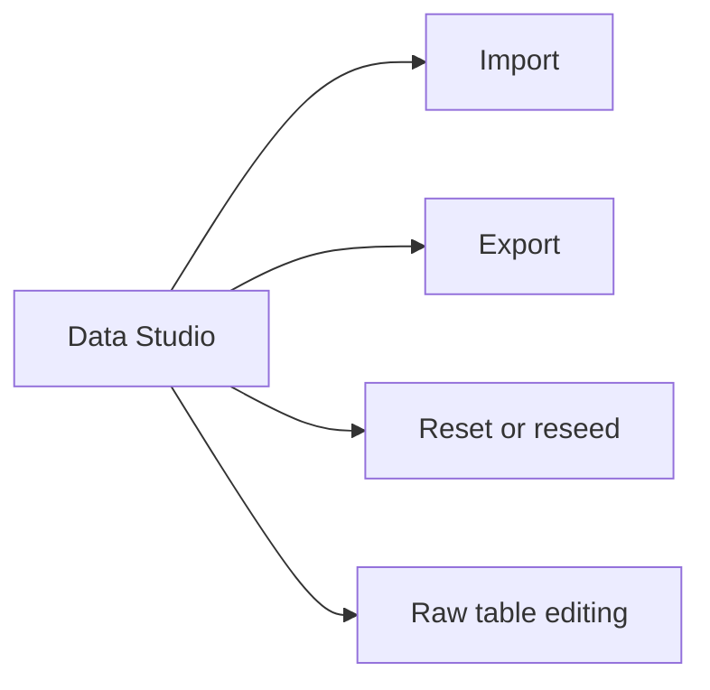

# Admin Journeys

This document explains the admin-facing experience for operating BidanApp.

Read this together with:

- [User-Facing Flow Diagrams](../user-facing-flow-diagrams.md)
- [Profile Admin Support Flow](../profile-admin-support-flow.md)
- [Production Rollout](../production-rollout.md)

## 1. Admin Surface Map

### Main routes

| Route | What the admin expects |
| --- | --- |
| `/admin/login` | authenticate into protected operations console |
| `/admin/overview` | quick command center and re-entry point |
| `/admin/customers` | inspect customer identities, contexts, and links |
| `/admin/professionals` | inspect and operate professional records |
| `/admin/services` | inspect and edit catalog-oriented rows |
| `/admin/appointments` | inspect operational booking rows |
| `/admin/support` | triage support tickets and urgency |
| `/admin/studio` | inspect or edit snapshot-style admin tables |

## 2. Login And Session Restoration

### Important admin-facing behavior

- Admin login is fully backend-authenticated.
- Last visited route is part of the resume experience.
- An already-authenticated admin should not feel forced through the login screen again.

### Main files

- `apps/frontend/src/components/screens/admin/AdminLoginScreen.tsx`
- `apps/frontend/src/features/admin/hooks/useAdminSession.ts`
- `apps/backend/internal/modules/adminauth/service.go`

## 3. Console Navigation Model

### Module intent

| Module | Focus area | User-facing purpose |
| --- | --- | --- |
| overview | all | orient the admin quickly |
| customers | ops | investigate customer-side context |
| professionals | reviews | review or operate professional lifecycle and records |
| services | catalog | inspect service, category, and offering structures |
| appointments | ops | inspect booking lifecycle and operational issues |
| support | support | triage customer and professional escalations |
| studio | all | raw-table and snapshot-level maintenance |

## 4. Data Hydration Model

### Why this matters

- Admin surfaces are not supposed to invent their own data ownership.
- The console is hydrated from backend-owned admin state and read-model fallbacks.
- Support desk is a separate operational surface from the general admin console snapshot.

## 5. Support Desk Journey

### Admin-facing meaning

| Stage | What the admin needs |
| --- | --- |
| intake | clear summary, category, urgency, reference |
| triage | enough context to decide severity and ownership |
| review | linked appointment, payment, chat, or account context when available |
| resolution | status change and operator note |

## 6. Studio And Data Operations

### Studio intent

- Studio is the maintenance surface for admin-owned tabular state.
- It is useful for QA, troubleshooting, and controlled operations.
- It should be treated carefully because its changes can ripple into customer, professional, and public experiences.

## 7. Cross-Persona Impact From Admin Actions

| Admin action | Customer impact | Professional impact |
| --- | --- | --- |
| edit appointment row | appointment status and notification context can change | request board and timeline can change |
| edit professional-related data | public detail and bookability can change | dashboard consistency can change |
| resolve support ticket | user escalation state changes | user escalation state changes |
| change service or category rows | discovery and matching can change | offering alignment can change |

## 8. Maintenance Cues

| Reported symptom | Check first |
| --- | --- |
| "Admin is bounced back to login" | admin session hydration and last-route restore |
| "Support desk is empty but tickets were submitted" | support desk hook and clientstate support endpoints |
| "Studio changed data but screen did not refresh" | admin console table sync and local event propagation |
| "Overview looks correct but module detail is stale" | read-model fallback versus table hydration path |
