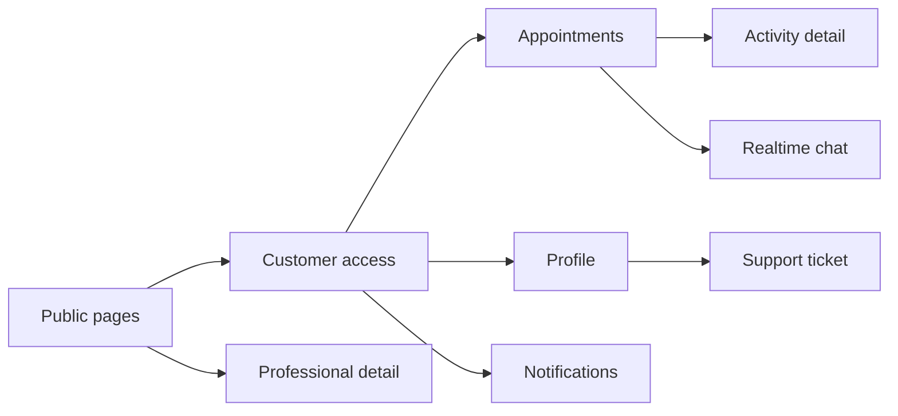
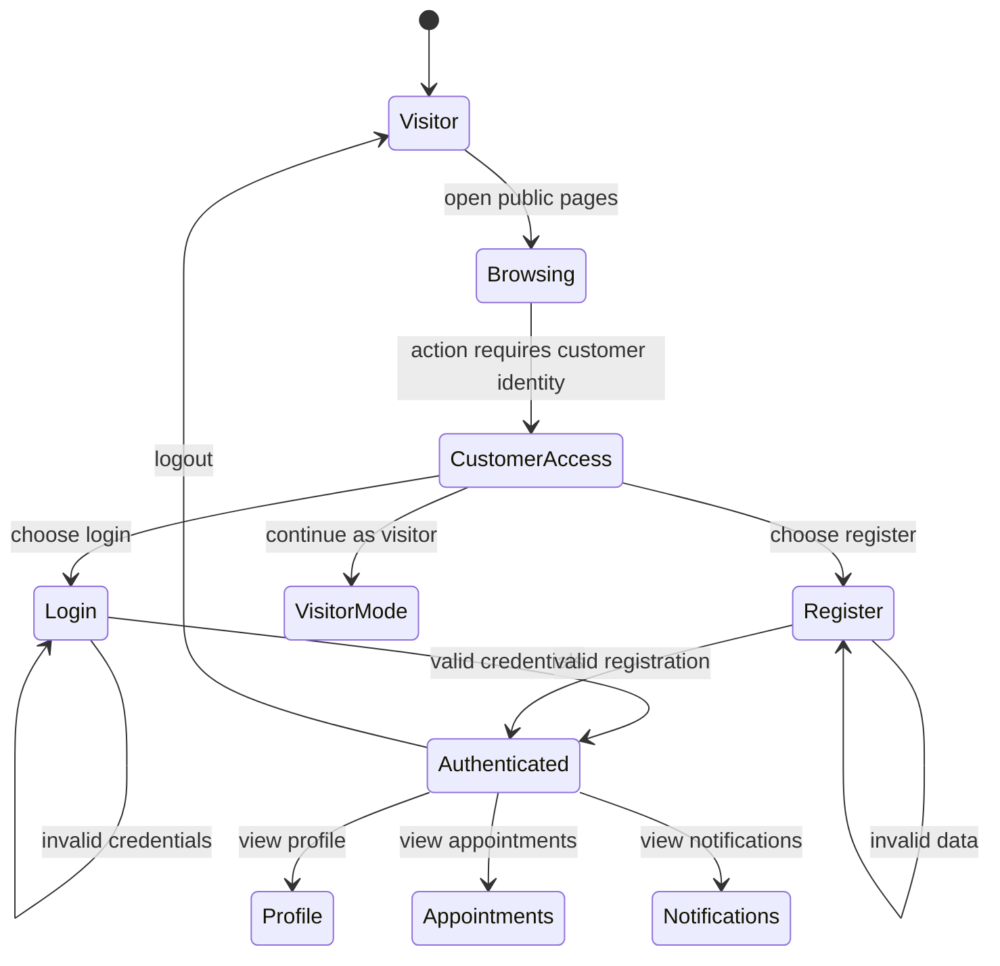
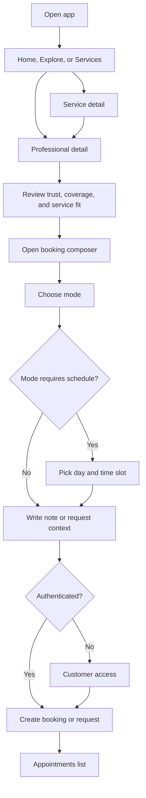
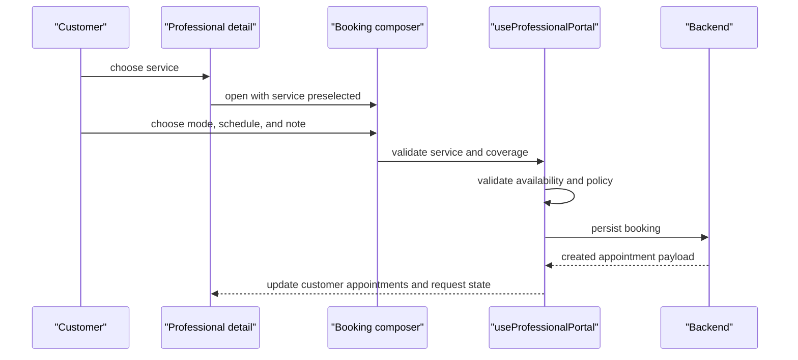
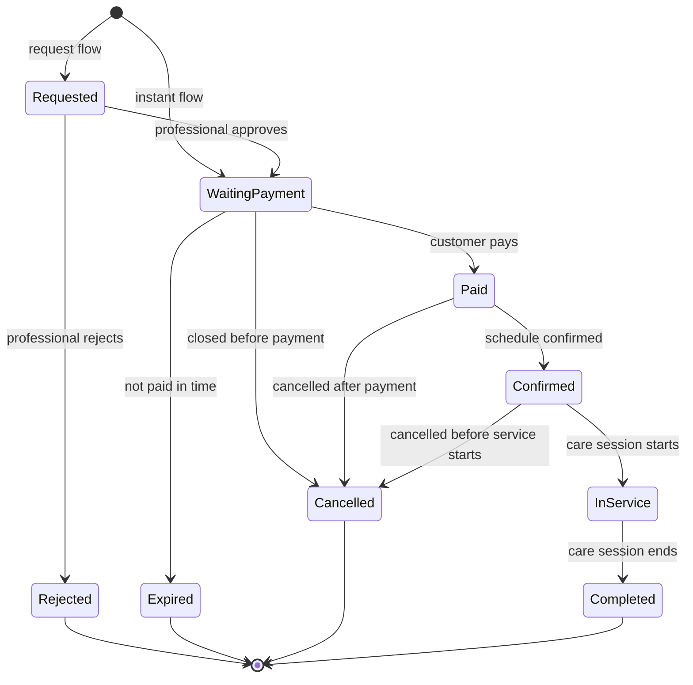
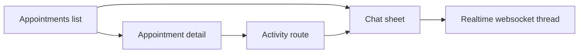
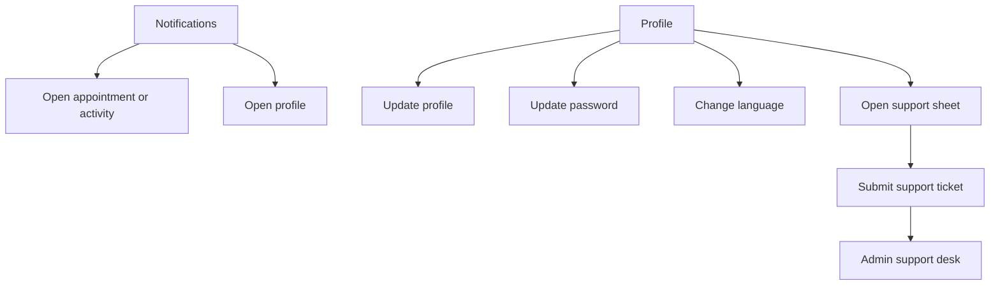

# Customer Journeys

This document describes the customer-facing experience from first visit to post-booking support.

Read this together with:

- [User-Facing Flow Diagrams](../user-facing-flow-diagrams.md)
- [Service To Appointment Flow](../service-to-appointment-flow.md)
- [Profile Admin Support Flow](../profile-admin-support-flow.md)

## 1. Customer Surface Map

### Main routes

| Route | What the customer expects |
| --- | --- |
| `/home` | quick summary, nearby professionals, and fast re-entry into care journey |
| `/explore` | browse professionals and service categories |
| `/services` | browse service-first catalog |
| `/s/[slug]` | understand a service and continue to a valid professional |
| `/p/[slug]` | compare a professional, validate trust, and compose a booking |
| `/auth/customer` | login, register, or continue as visitor |
| `/appointments` | see active and historical care engagements |
| `/appointments/[id]` | focus on a single appointment |
| `/activity/[id]` | inspect timeline and progress of one appointment |
| `/notifications` | see appointment and setup reminders |
| `/profile` | manage account, security, language, and support |

## 2. Entry And Identity Flow

### Identity behaviors

| Behavior | Frontend effect | Backend effect |
| --- | --- | --- |
| login | customer session hook becomes authenticated | session document is created or refreshed |
| register | customer becomes authenticated immediately | account document and session are created |
| continue as visitor | browsing can continue without account actions | no customer-owned data is created |
| revisit protected route | session hook rehydrates before rendering target screen | session endpoint validates current session |

### Main files

- `apps/frontend/src/components/screens/CustomerAccessScreen.tsx`
- `apps/frontend/src/lib/use-customer-auth-session.ts`
- `apps/frontend/src/lib/use-viewer-session.ts`
- `apps/backend/internal/modules/customerauth/routes.go`
- `apps/backend/internal/modules/customerauth/service.go`

## 3. Discovery To Booking Journey

### Key customer-facing rules

- Service detail is informational and routing-oriented.
- Professional detail is transactional because only there can the app evaluate service offering, delivery mode, coverage, and availability together.
- A professional must be `published` to behave like a normal public booking target.
- `home_visit` is only valid when area and radius rules both pass.
- Offline modes require the customer to choose a valid day and slot.

## 4. Booking Composer Behavior

### Booking outputs

| Input area | User-facing intent | Resulting persisted shape |
| --- | --- | --- |
| service | choose the care package | service snapshot |
| mode | choose online, home visit, or onsite | schedule and delivery mode snapshot |
| day and slot | choose actual visit window when required | immutable schedule snapshot |
| note | explain context or need | request note and timeline context |

### Main files

- `apps/frontend/src/features/professional-detail`
- `apps/frontend/src/lib/use-professional-portal.ts`
- `apps/frontend/src/lib/professional-availability.ts`
- `apps/backend/internal/modules/appointments`

## 5. Appointment Lifecycle From Customer View

### Screen behavior by appointment state

| State | Typical customer perception | Available actions |
| --- | --- | --- |
| `requested` | request sent and waiting for professional action | view details, possibly cancel, possibly chat if allowed |
| `approved_waiting_payment` | request accepted but payment is pending | pay, inspect details, possibly cancel |
| `paid` | payment accepted and waiting for final service lock | view details, possibly cancel under policy |
| `confirmed` | visit or consultation is scheduled | chat, inspect timeline, possibly cancel under policy |
| `in_service` | session is running | mainly read timeline and chat if allowed |
| `completed` | session is finished | review and read history |
| `cancelled`, `rejected`, `expired` | transaction is closed | read history and resolution outcome |

## 6. Appointments, Activity, And Chat

### Behavioral details

- The appointments screen is the operational inbox for the customer.
- The activity route gives a timeline-first view for one appointment.
- Chat is not a separate independent entity from the customer perspective; it is contextual communication around a professional or appointment thread.
- When the selected appointment status no longer allows chat, the UI closes or disables the chat entry point.

### Main files

- `apps/frontend/src/features/appointments/hooks/useAppointmentFlow.ts`
- `apps/frontend/src/features/appointments/components/AppointmentsList.tsx`
- `apps/frontend/src/features/appointments/components/AppointmentDetailSheet.tsx`
- `apps/frontend/src/components/screens/ChatScreen.tsx`
- `apps/frontend/src/lib/use-realtime-chat-thread.ts`

## 7. Notifications, Profile, And Support

### Behavior details

| Surface | What the customer sees | Runtime consequence |
| --- | --- | --- |
| notifications | unread reminders and appointment-derived events | read state is persisted in backend client state |
| profile | current identity, city, shortcuts, language, and support | customer account and viewer shell are refreshed |
| support | categorized ticket form with urgency and channel | support desk entry appears for admin |

### Important rules

- The profile screen is customer-authenticated. If not authenticated, the user is routed to customer access.
- If the current viewer is actually in professional mode, the profile route redirects toward the professional profile surface.
- Support is a cross-role bridge from customer experience into admin operations.

## 8. Maintenance Cues

| Reported symptom | Check first |
| --- | --- |
| "I can browse but cannot book" | professional detail screen, booking composer, customer access redirect |
| "My appointment status looks wrong" | appointment flow hook, appointment status mapping, backend appointment projection |
| "Chat disappeared" | appointment status gating and realtime thread hook |
| "I submitted support but no one replied" | support sheet submission and admin support desk hydration |
