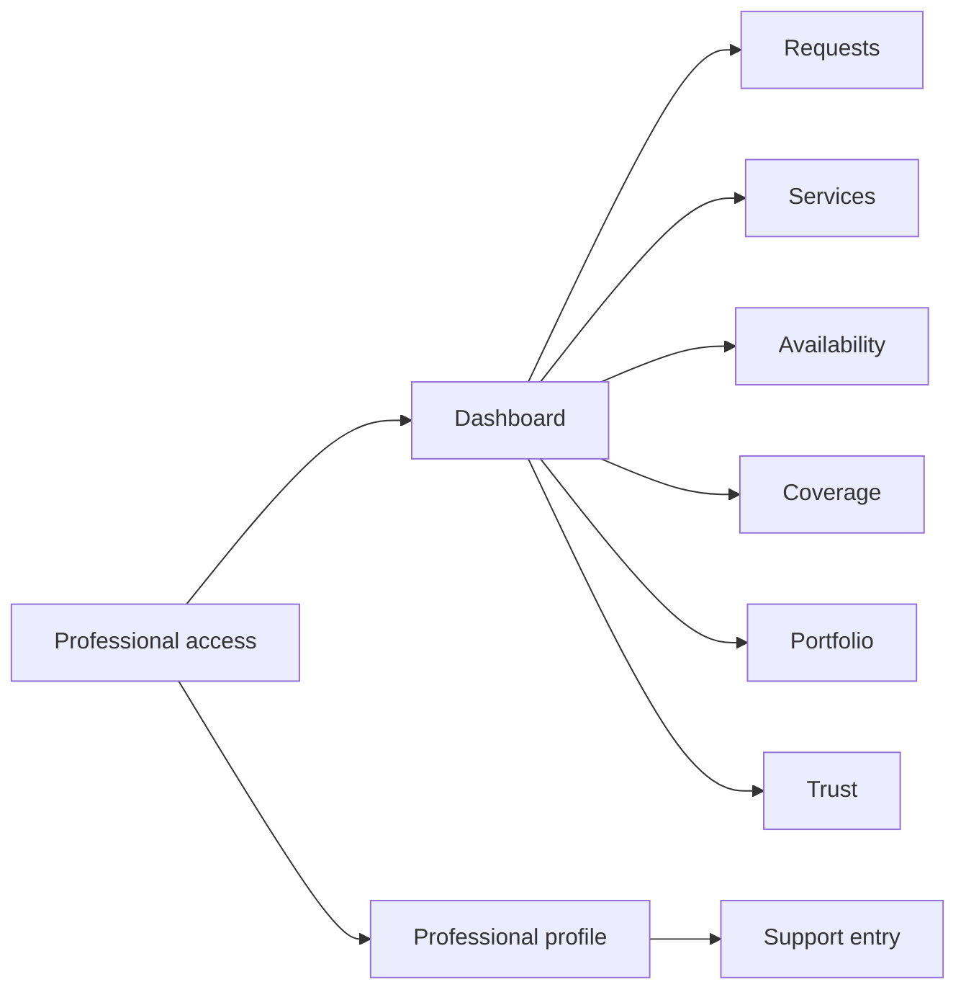
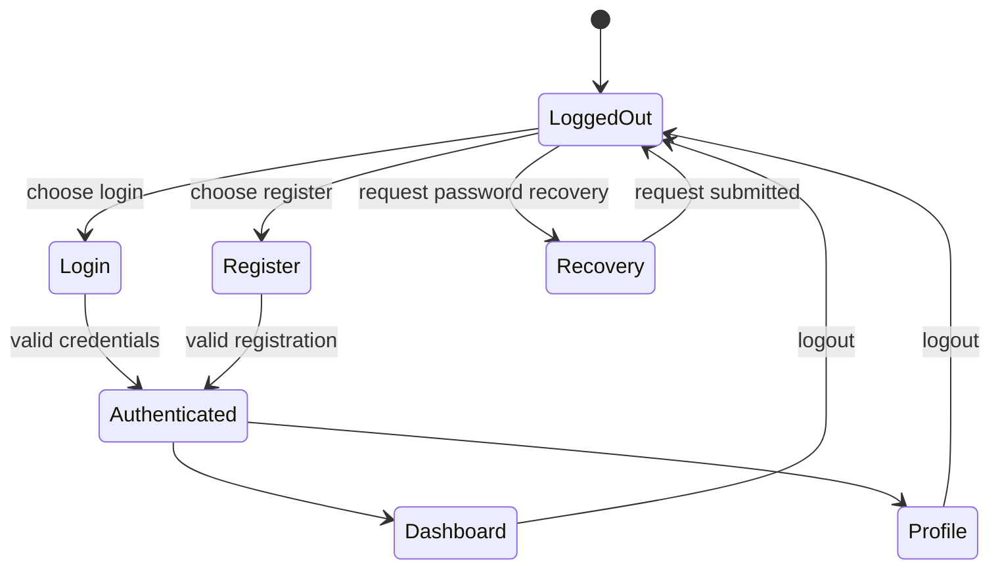
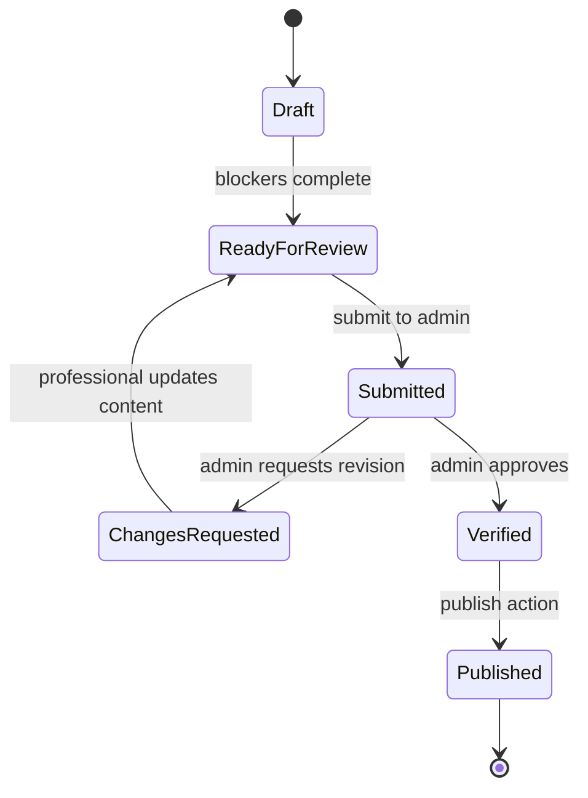
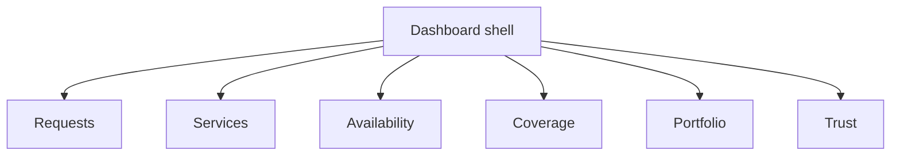
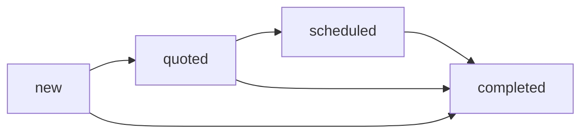
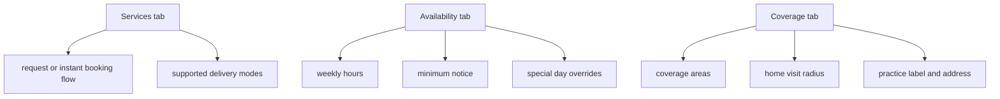
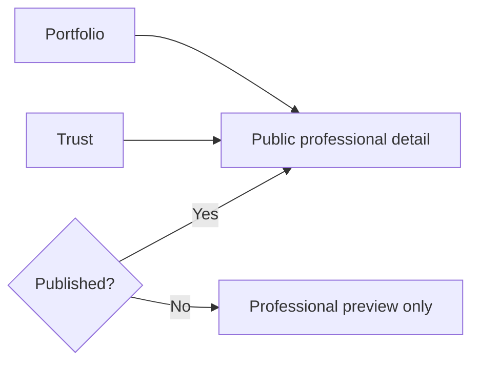
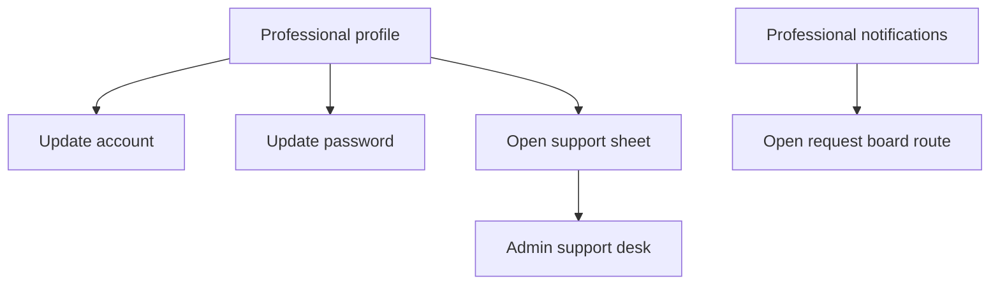

# Professional Journeys

This document explains the professional-facing experience from access to published operations.

Read this together with:

- [User-Facing Flow Diagrams](../user-facing-flow-diagrams.md)
- [Professional Onboarding Flow](../professional-onboarding-flow.md)
- [Service To Appointment Flow](../service-to-appointment-flow.md)

## 1. Professional Surface Map

### Main routes

| Route | What the professional expects |
| --- | --- |
| `/for-professionals` | login, register, account switching, password recovery |
| `/for-professionals/dashboard/requests` | booking demand queue and request handling |
| `/for-professionals/dashboard/services` | control live offerings and booking flow |
| `/for-professionals/dashboard/availability` | control working hours and booking constraints |
| `/for-professionals/dashboard/coverage` | control service area and practice location |
| `/for-professionals/dashboard/portfolio` | shape public proof of work |
| `/for-professionals/dashboard/trust` | shape credentials and trust stories |
| `/for-professionals/profile` | manage account, identity, and security |

## 2. Access Flow

### Access behavior

| Behavior | What happens in UI | What happens in backend |
| --- | --- | --- |
| login | professional screen authenticates and redirects to dashboard | professional session is created or refreshed |
| register | professional becomes authenticated immediately | professional account and session are created |
| choose professional identity | selected identity is bound to the login request | professional session is scoped to a professional id |
| password recovery | recovery state is shown in access screen | recovery request is handled by professional auth service |

### Main files

- `apps/frontend/src/components/screens/ProfessionalAccessScreen.tsx`
- `apps/frontend/src/lib/use-professional-auth-session.ts`
- `apps/backend/internal/modules/professionalauth/service.go`

## 3. Onboarding And Publication Lifecycle

### Lifecycle meaning

| Status | Professional-facing meaning | Public visibility |
| --- | --- | --- |
| `draft` | onboarding not complete | hidden |
| `ready_for_review` | complete enough to submit | hidden |
| `submitted` | waiting for admin review | hidden |
| `changes_requested` | blocked until revision | hidden |
| `verified` | approved but not yet live | hidden |
| `published` | fully live and operational | visible in public catalog |

### What makes the lifecycle feel real to the professional

- completion score
- missing section prompts
- review outcome messaging
- publish-state badges
- request board behavior once live

## 4. Dashboard Navigation Model

### Dashboard sections

| Section | What the professional does | Public or operational impact |
| --- | --- | --- |
| requests | review and update booking demand | changes customer appointment experience |
| services | enable offerings, set booking flow, tune summaries and pricing | changes what is bookable and how it enters lifecycle |
| availability | define weekly hours, notice windows, and offline constraints | changes customer booking slot generation |
| coverage | define where service is actually available | changes home-visit eligibility |
| portfolio | define public portfolio entries and gallery | changes public professional detail presentation |
| trust | define credentials and recent activity stories | changes public trust presentation |

### Main files

- `apps/frontend/src/components/screens/professional-dashboard/*`
- `apps/frontend/src/components/screens/professional-dashboard/useProfessionalDashboardPageData.ts`
- `apps/frontend/src/lib/use-professional-portal.ts`
- `apps/backend/internal/modules/professionalportal/service.go`

## 5. Request Handling Lifecycle

### Projection meaning

| Professional board bucket | Appointment states behind it |
| --- | --- |
| `new` | `requested` |
| `quoted` | `approved_waiting_payment`, `paid` |
| `scheduled` | `confirmed`, `in_service` |
| `completed` | `completed`, `cancelled`, `rejected`, `expired` |

### Professional-facing actions

| Action | Effect on customer |
| --- | --- |
| approve request | customer sees accepted flow and payment stage |
| reject or close | customer sees terminal resolution |
| confirm service | customer sees scheduled state |
| complete service | customer sees completed care journey |

## 6. Operational Controls: Services, Availability, Coverage

### Why these sections matter

- Services decides what is sellable.
- Availability decides when the sellable thing can be delivered.
- Coverage decides where the deliverable thing is actually valid.

This split is important because a professional can appear well-configured in one section but still remain unbookable if another section is incomplete.

## 7. Public Presentation Controls: Portfolio And Trust

### Public-facing outputs

| Section | Public effect |
| --- | --- |
| portfolio | portfolio cards, gallery, work history |
| trust | credentials, activity stories, trust proof |
| published lifecycle | determines whether portal state overlays public read-model |

## 8. Profile, Notifications, And Support

### Behavior details

- Professional notifications are operational, not merely informational.
- Notification links usually route back into dashboard tabs and filtered request states.
- Support bridges professional operations into admin triage.

## 9. Maintenance Cues

| Reported symptom | Check first |
| --- | --- |
| "I logged in but got the wrong professional account" | professional access identity selection and professional session scope |
| "My profile says published but public page is stale" | portal review state and read-model overlay |
| "Customers cannot see my home-visit slots" | services, availability, and coverage working together |
| "My request board status is wrong" | professional request projection from appointment status |
